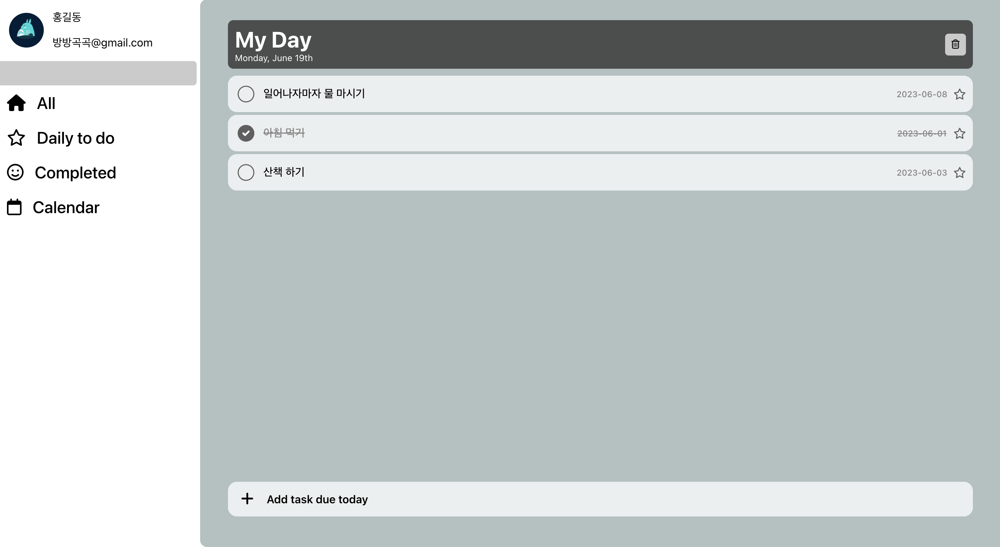
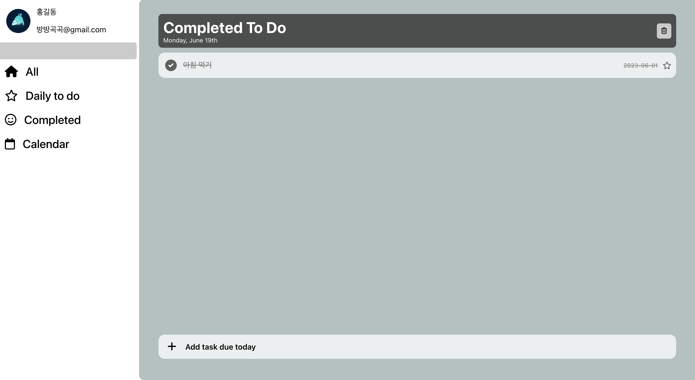
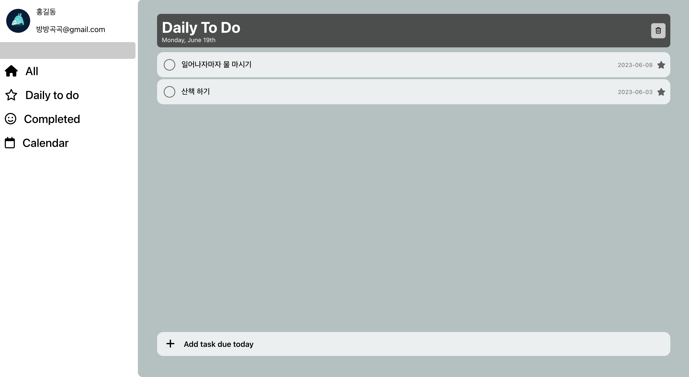
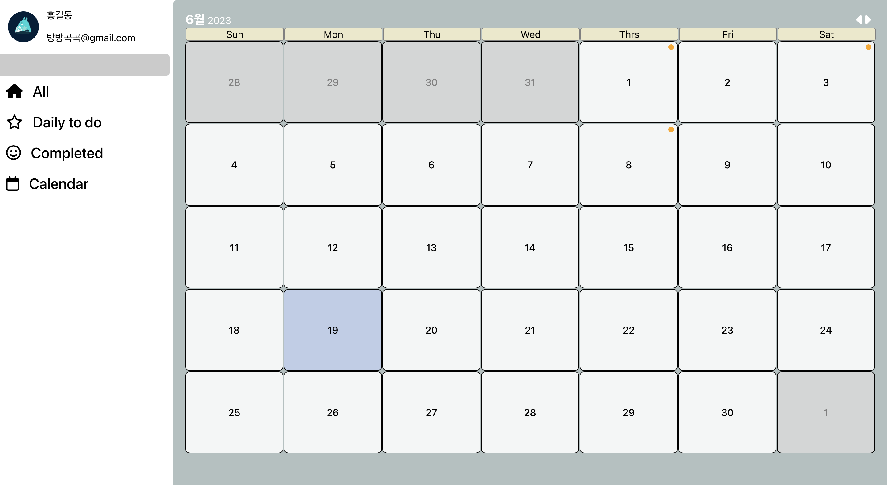
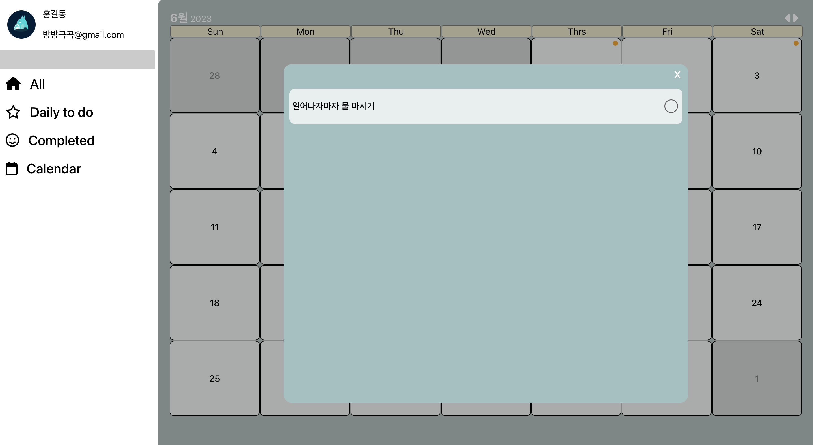

# Micro Todo

## 목차

- <a href='#정적'>정적 페이지</a>
- <a href='#기능'>기능구현 목록</a>

---

microsoft todo를 reference로 todo list를 제작해보는 프로젝트 입니다.

먼저 정적인 페이지를 완성한 이후 기능 구현을 하는 방식으로 진행할 예정입니다.

## 1. 정적 페이지

## 2. 기능구현 목록

- Todo CRUD

  일정을 추가, 수정, 삭제, 조회 할 수 있습니다.

- 완료목록

  완료된 일정을 모아서 확인할 수 있습니다.
  

- 반복 일정 목록

  매일 반복할 일정을 모아서 확인할 수 있습니다.
  

- 달력

  달력을 통해 일정 히스토리를 파악할 수 있습니다.
  
  

추가될 예정의 기능들

- todo 날짜 지정 및 날짜 수정
- 반복 일정 상태 초기화 - 매일 00:00에 일정 완료 상태 초기화
